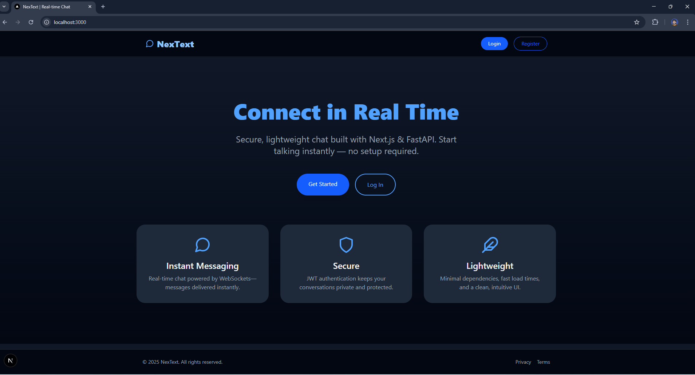
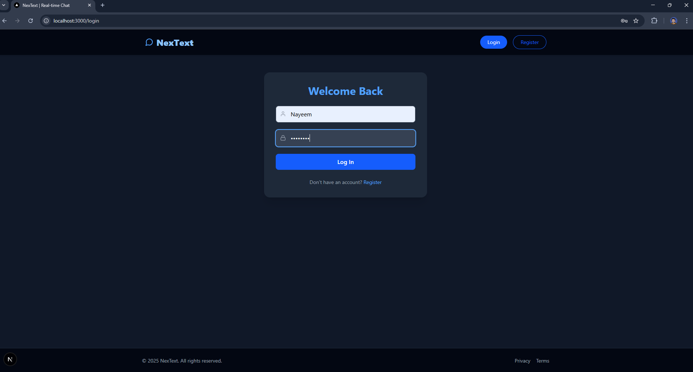
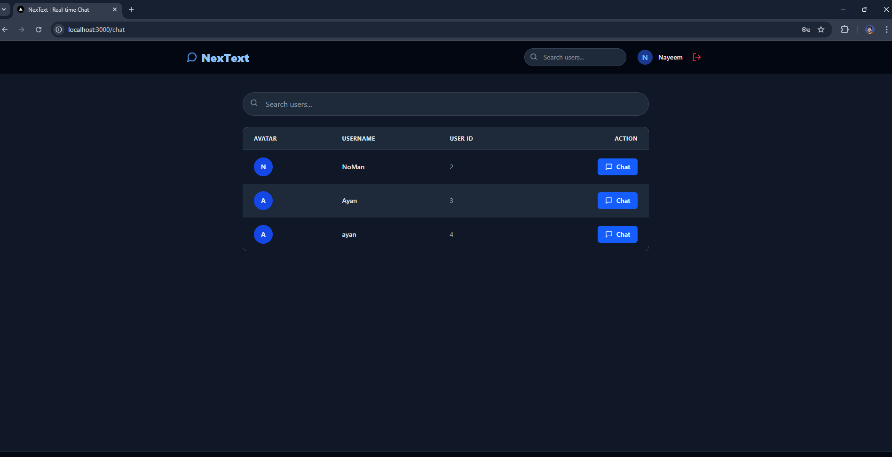
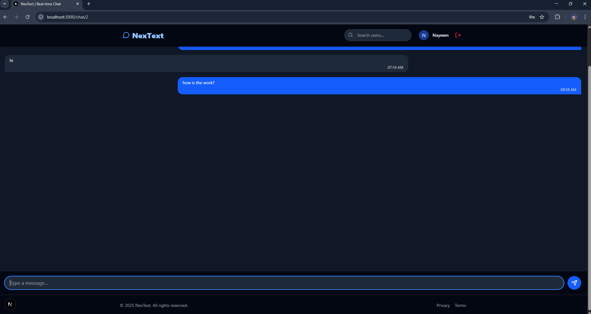
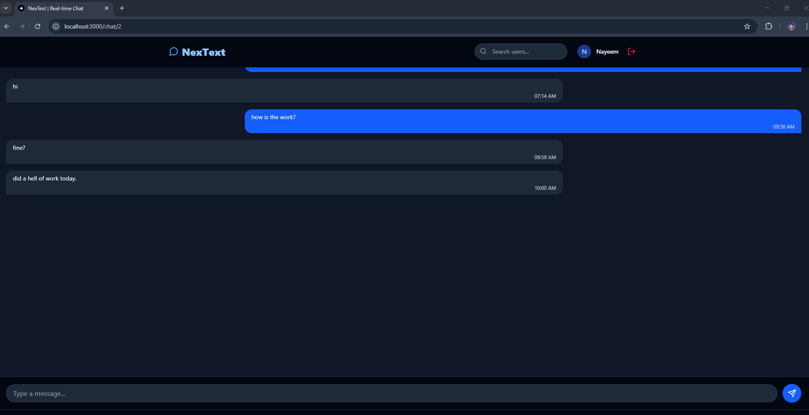

# NexText

**NexText** is a minimal, real-time chat application powered by WebSockets (and WebRTC-ready).  
- 🧠 **Backend**: Python + FastAPI  
- 💻 **Frontend**: Next.js 15 + Tailwind CSS  
- 🐳 Fully **Dockerized** for development and deployment  

---

## 🚀 Features

- Real-time messaging using WebSockets  
- JWT authentication  
- Fast, clean UI built with Tailwind + React Icons  
- Built for extensibility with WebRTC and database support  

---

## 🛠️ Getting Started

### 1. 📥 Clone the Repo

```bash
git clone https://github.com/your-username/nextext.git
cd nextext
```

### 2. 🔧 Run Locally (Without Docker)
➤ Backend (FastAPI)
```bash
cd backend
python -m venv venv
source venv/bin/activate  # or venv\Scripts\activate on Windows
pip install -r requirements.txt
uvicorn app.main:app --reload
```

➤ Frontend (Next.js)
```bash
cd frontend
npm install
npm run dev
```

- Access frontend at: `http://localhost:3000`
- Backend runs at: `http://localhost:8000`


### 3. 🐳 Run with Docker & Docker Compose

```bash
docker-compose up --build
```

- Frontend: `http://localhost:3000`
- Backend API: `http://localhost:8000`


### App in Action
<div align="center">
  
  
  
  
  
  
</div>
